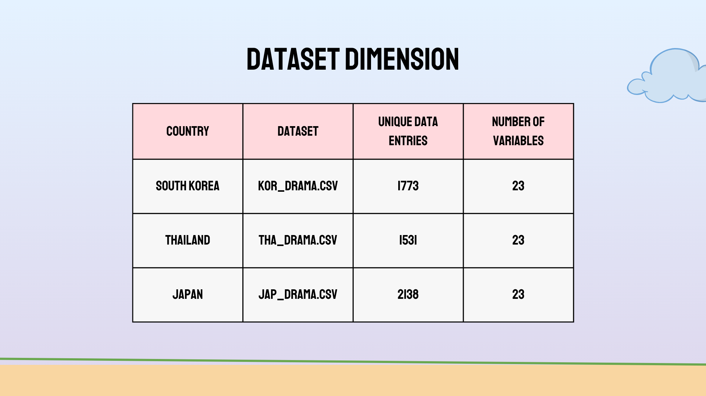

# Data Mining: THAxJPNxKOR Data Visualization

This is part of DES434 Data Mining and Machine Learning Midterm Project. The aim of this project is to explore the data and construct hypothesis testing. Students are free to select any dataset from Kaggle under the theme "Movie and Drama". I decided to have fun and gather the information to create my own dataset!

    <h3>The objective of this project is to answer the following question~</h3>
    

## Dataset Creation

Previously, I have uploaded a dataset onto Kaggle on Korean Drama from 2015-2023. With slight modification and feature engineering, the code that was used to scrape the data was implemented for Thai and Japanese Drama intead. The data that was used for this project is comprised into the following dataset: "Thai and Japanese Drama vs. Korean Drama Dominance". Here is the dataset dimension, seperated by countires.

    

## What is "Scored Significant"
Fighting against the formidable opponent that received endorsement from the entire civilization known as Korean Drama, Lakorn Thai, and Japanese Drama cannot compete in terms of overall viewership. From our data, the statistics showed that the viewership of Korean dramas around 6.9 million (6,952,512) outshined Lakorn Thai (2,074,737) and Japanese Drama (933,435). We argued that Thai and Japanese drama are niche categories of drama that are noteworthy for being classified as “Hidden Gem of Asia” - they are niche, but they are outstanding. Given the context and the theory we proposed, we argued that it is not appropriate to use viewership to make final judgment regarding the drama performance. Henceforth, we came up with a new metric to help with the comparison. 

$$
\text{Scored Significant} = \frac{\text{Total User Score} \times \text{Total Number of Users that Cast the Vote}}{\text{Total Viewership}}
$$

Scored Significant is a measurement that reflects the weighted user rating for each drama. This approach offers a concise and comprehensive means of evaluating drama performance by emphasizing the crucial factor of audience engagement. By combining user scores with the number of voters relative to total viewership, Scored Significant effectively quantifies how a drama engages its audience. This approach's distinct advantage lies in its ability to differentiate dramas based not only on their ratings but also on their capacity to involve a substantial portion of their viewers in the evaluation process. allowing a more accurate assessment of a drama's significance. 

    
    

## Hypothesis Testing 
There are two questions that need to be answer for this project
1. Is there a significant difference in the average viewer ratings of drama TV shows among these three countries?
2. What is the most popular geners of drama from each countires (Thailand, Japan, and Korea)? How do they compare with other countires?

The full hypothesis testing can be found in one of the notebook.

## Visualization and Data Analysis

    

## Result from Analysis

    
    
    

## Sample Famous Drama from Thailand, Japan, and South Korea!
These dramas are selected based on the score significant matrix and the top performing genres from each country. 

    
    
    

## Thank you!
